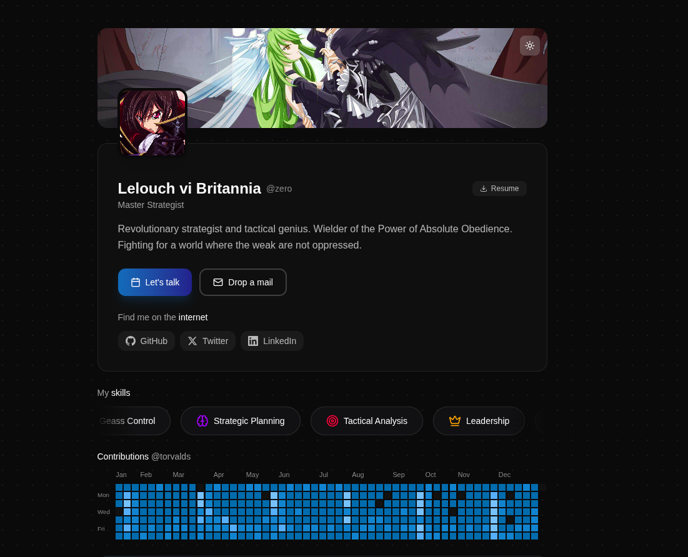
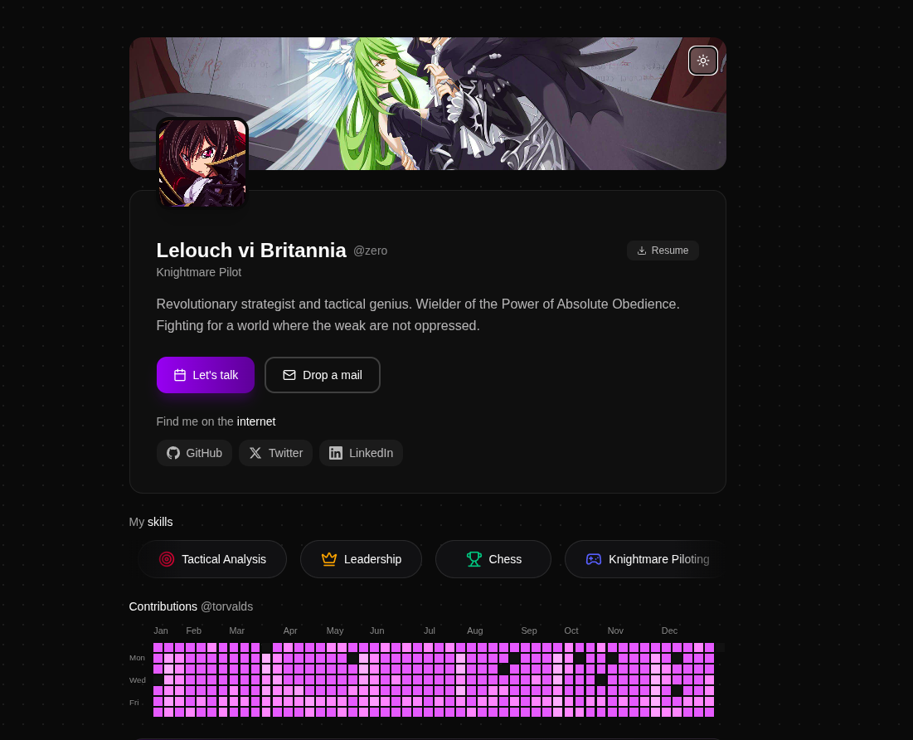
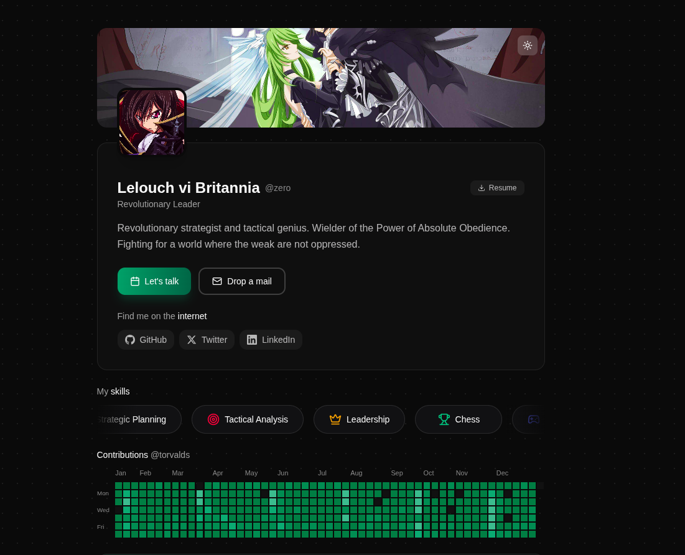
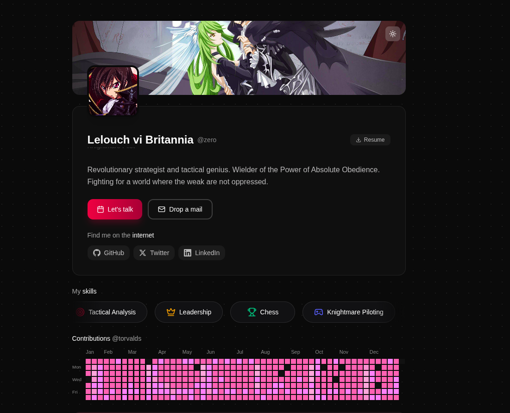
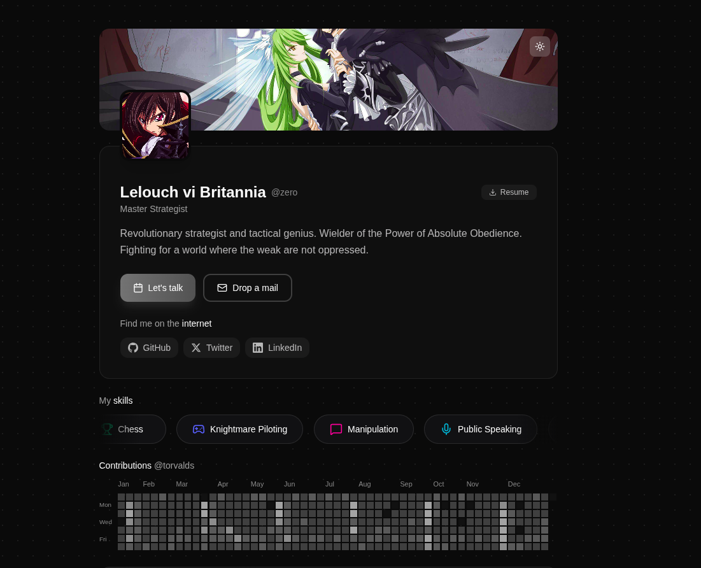

# Porthat

A modern, customizable portfolio template built with TanStack Start and React 19. Configure everything from a single JSON file and deploy in minutes.


## Tech Stack

| Category | Technology |
|----------|------------|
| Framework | TanStack Start (React 19) |
| Styling | Tailwind CSS v4 |
| Animations | Framer Motion |
| Icons | Lucide React |
| Language | TypeScript |
| Build | Vite 7 |

## Features

**Configuration**
- Single-file setup via `data.json`
- 6 built-in theme presets
- Custom themes via Coolors.co URLs
- Light and dark mode with animated transitions

**Components**
- Hero section with avatar, banner, and social links
- Auto-scrolling skill carousel
- GitHub contribution chart integration
- Spotify now playing widget
- Expandable experience and education sections
- Project cards with gradient hover effects
- Blog section with reading time estimates
- Footer with rotating quotes

**Technical**
- Responsive mobile-first design
- SEO optimized with Open Graph meta tags
- View Transitions API for smooth theme switching
- Sections auto-collapse when items exceed 4

## Quick Start

```bash
git clone https://github.com/pixperk/porthat.git
cd porthat
npm install
npm run dev
```

Open http://localhost:3000 to view your portfolio.

## Configuration

Edit `src/data/data.json` to customize your portfolio:

```json
{
  "theme": "monochrome",
  "github": "your-github-username",
  "illustration": false,
  "profile": {
    "name": "Your Name",
    "handle": "username",
    "avatar": "https://...",
    "banner": "https://...",
    "bio": "Your bio here",
    "location": "City, Country",
    "resumeUrl": "https://...",
    "email": "you@email.com"
  },
  "roles": ["Developer", "Designer"],
  "socials": [...],
  "skills": [...],
  "experience": [...],
  "education": [...],
  "projects": [...],
  "blogs": [...],
  "quotes": [...]
}
```

### Profile Fields

| Field | Description |
|-------|-------------|
| name | Display name |
| handle | Username shown in footer |
| avatar | Profile picture URL |
| banner | Header background image URL |
| bio | Short description |
| location | Your location |
| resumeUrl | Link to resume/CV |
| email | Contact email |

### Skills

```json
{
  "name": "TypeScript",
  "icon": "code",
  "color": "#3178C6"
}
```

Available icons: `brain`, `target`, `crown`, `trophy`, `gamepad`, `message`, `mic`, `eye`, `code`, `database`, `globe`, `server`, `terminal`, `zap`

### Experience

```json
{
  "company": "Company Name",
  "role": "Your Title",
  "type": "Full-time",
  "period": "2022 - Present",
  "location": "Remote",
  "details": [
    "Achievement or responsibility",
    "Another bullet point"
  ]
}
```

### Education

```json
{
  "institution": "University Name",
  "degree": "Bachelor's Degree",
  "field": "Computer Science",
  "period": "2018 - 2022",
  "location": "City, Country",
  "grade": "3.8 GPA",
  "details": ["Relevant coursework", "Activities"]
}
```

### Projects

```json
{
  "id": "1",
  "title": "Project Name",
  "slug": "project-slug",
  "description": "What the project does",
  "image": "https://...",
  "tags": ["React", "TypeScript"],
  "github": "https://github.com/...",
  "demo": "https://...",
  "featured": true
}
```

### Blog Posts

```json
{
  "slug": "post-slug",
  "title": "Post Title",
  "date": "2024-01-15",
  "excerpt": "Brief summary",
  "tags": ["Topic"],
  "coverImage": "https://...",
  "readingTime": "5 min"
}
```

## Themes

Set the `theme` field in `data.json` to any preset name.

### Ocean



### Midnight



### Sunset


### Forest



### Rose



### Monochrome



### Custom Themes

Create a palette on [Coolors.co](https://coolors.co) and use the URL programmatically:

```typescript
const { setCustomTheme } = useTheme();
setCustomTheme("https://coolors.co/264653-2a9d8f-e9c46a-f4a261-e76f51");
```

Colors map to: `primary`, `secondary`, `accent`, `highlight`, `muted`

## Demo Mode

Set `"illustration": true` in `data.json` to enable the demo panel:

- Preview all theme presets live
- Toggle between light and dark modes
- View complete feature list
- Access documentation

Set to `false` before deploying to production.

## Deployment

### Vercel

```bash
npm run build
vercel deploy
```

### Netlify

```bash
npm run build
netlify deploy --prod
```

### Docker

```dockerfile
FROM node:20-alpine
WORKDIR /app
COPY package*.json ./
RUN npm install
COPY . .
RUN npm run build
EXPOSE 3000
CMD ["npm", "run", "preview"]
```

## Project Structure

```
src/
  components/portfolio/
    Hero.tsx            Profile header with avatar and socials
    Experience.tsx      Work history with expandable details
    Education.tsx       Academic background
    Projects.tsx        Project cards with gradient hover
    Blog.tsx            Blog post listings
    SkillSlider.tsx     Auto-scrolling skill carousel
    GitHubChart.tsx     GitHub contribution graph
    SpotifyWidget.tsx   Now playing widget
    Footer.tsx          Quotes and credits
    IllustrationOverlay.tsx   Demo mode panel
  context/
    ThemeContext.tsx    Theme state management
  lib/
    themes.ts           Theme presets and utilities
    constants.ts        Animation variants
  types/
    portfolio.ts        TypeScript interfaces
  data/
    data.json           Portfolio content
```

## Scripts

| Command | Description |
|---------|-------------|
| `npm run dev` | Development server on port 3000 |
| `npm run build` | Production build |
| `npm run preview` | Preview production build |
| `npm run test` | Run tests with Vitest |

## License

MIT
